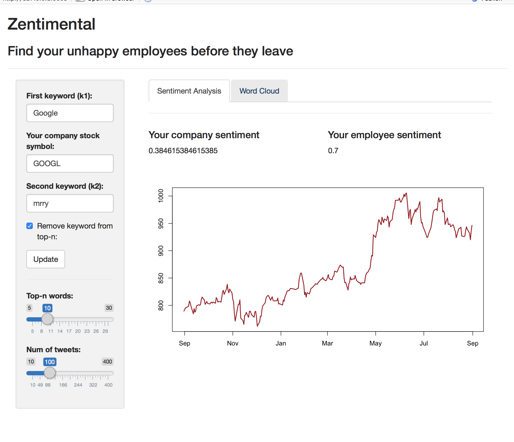
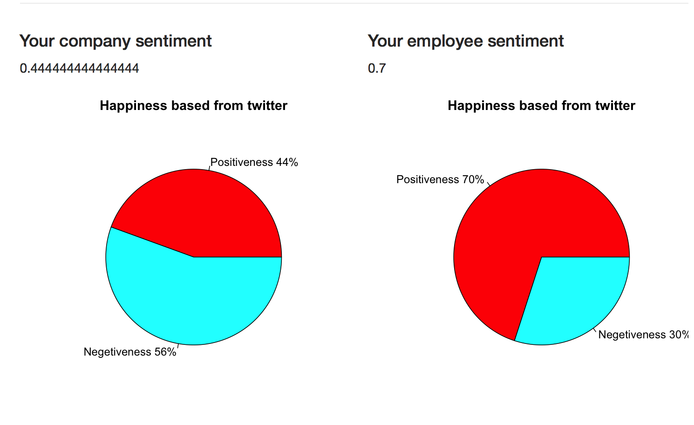

# Zentimental_R

## Know your employees

Get sentiment analysis of your company and your employees on the fly,



Remember to add your twitter api keys in the `helpers.R` file

```bash
git clone https://github.com/HamedMP/Zentimental_R
```

Open server.R or ui.R in RStudio, Run the application


